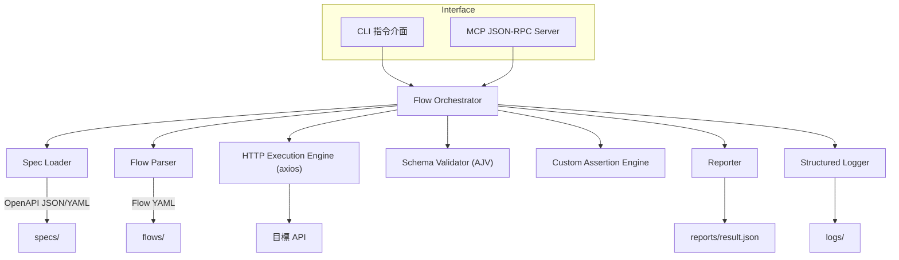
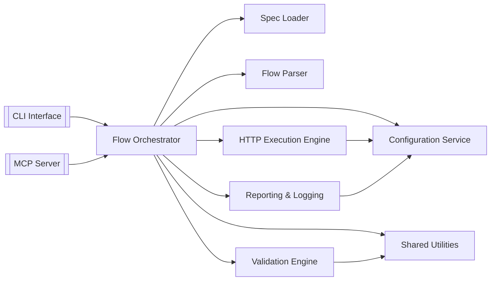

# SpecPilot 後端架構文件

## 版本資訊
| 日期 | 版本 | 說明 | 作者 |
| --- | --- | --- | --- |
| 2025-09-26 | v0.1 | 初版架構草案匯整，對應《SpecPilot PRD v4》 | Winston (Architect) |

## 導言
本文件說明 SpecPilot 專案的整體後端系統架構，涵蓋 API 驅動的服務層、流程協調器、共用服務與非 UI 專屬的關注事項。宗旨是為 AI 駆動開發流程提供一致且可延伸的藍圖，確保所有實作遵循約定的技術堆疊與設計模式。

**與前端架構的關係：** 若專案後續新增大型使用者介面，需撰寫獨立的〈前端架構文件〉並與本文件搭配使用。本文件中的技術堆疊決策（見〈技術堆疊〉）對整個系統具約束力，前端模組亦須遵循。

## 起始模板 / 既有專案來源
目前資料夾僅包含規格與 PRD，未見既有程式碼或腳手架；判定為全新綠地專案，後端服務與工具需自行搭建與設定。

## 高階架構

### 技術摘要
SpecPilot 採模組化單體（Modular Monolith）+ 六角式分層，核心分成 CLI / MCP 介面層、流程協調器、規格與流程解析服務、HTTP 執行引擎、驗證與報告模組。各模組以 TypeScript 撰寫並透過依賴注入協作，確保 CLI、自動化流程與 MCP Agent 共用同一條驗證管線。技術堆疊以 Node.js 18+ 並鎖定 20.11.1 LTS 搭配 TypeScript 5.4.5，整合 axios、yaml、swagger-parser、ajv 等工具。設計滿足 PRD 所述「自動驗證 API 規格、輸出報告、供 AI 代理使用」，並兼顧後續擴充與運行成本。

### 概念性描述
1. **架構型態：** 模組化單體，藉六角式介面分層隔離外部輸入（CLI/MCP/檔案）與核心領域。與微服務相比，部署成本低、同步管理容易。
2. **版本庫策略：** 依 PRD 指示採 Monorepo，集中管理 CLI、MCP 與核心套件，利於 AI 與人類開發者協作。
3. **服務切割：** 單一 Node.js 應用提供 CLI 指令與 JSON-RPC 介面，內部再拆為規格載入器、流程協調器、HTTP 執行器、驗證器、報告器。
4. **資料/互動流程：** 使用者或 AI 透過 CLI / MCP 呼叫 → 協調器載入 OpenAPI 與 Flow → 依序執行 HTTP 呼叫 → 驗證狀態碼 / Schema / 自訂規則 → 寫入報告與結構化日誌。
5. **關鍵決策：**
   - 以檔案系統 (`specs/`, `flows/`, `reports/`) 作為主要儲存，符合 Epic 需求。
   - HTTP 引擎包裝 axios 支援 Token、重試與 Timeout。
   - 驗證層使用 AJV 搭配自訂 keywords 完成 custom.notNull/regex 等擴充。
   - 日誌採 JSON Lines（Pino），滿足 NFR6 的可追蹤性與安全性。

### 高階系統圖


### 架構與設計模式
- **模組化單體 + 六角式架構：** 相較傳統三層或微服務，兼顧短期效率與長期可拆分彈性。
- **依賴反轉 / 輕量 DI：** 使用容器（tsyringe 或自製 factory）統一注入 HTTP 客戶端、Logger、設定服務，提高測試性。
- **管線式流程處理：** 每個 Flow Step 透過 HTTP → Schema → Custom Rules → Reporter 的管線模式處理，便於插入額外驗證。
- **結構化日誌 + 事件代碼：** 使用 JSON Lines 格式與事件代碼，方便之後接入觀測或告警系統。

## 技術堆疊
> 下表為唯一真實來源（Single Source of Truth）。

| 類別 | 技術 | 版本 | 目的 | 理由 |
| --- | --- | --- | --- | --- |
| Language | TypeScript | 5.4.5 | 主力開發語言 | 強型別支援 CLI/MCP 共同程式碼 |
| Runtime | Node.js | 20.11.1 LTS | 執行核心 | LTS 穩定、支援最新 API |
| Package Manager | pnpm | 9.1 | Monorepo 管理 | 節省磁碟、工作區支援成熟 |
| CLI Framework | commander | 11.1 | 指令解析 | PRD 指定、API 穩定 |
| HTTP Client | axios | 1.6.8 | 發送 API 請求 | 攔截器支援 Token/重試 |
| YAML Parser | yaml | 2.4.3 | Flow/OpenAPI 解析 | AST 能力充足 |
| OpenAPI Validator | @apidevtools/swagger-parser | 10.1.0 | 驗證/展開規格 | 支援 dereference 與驗證 |
| Schema Validator | ajv | 8.12.0 | JSON Schema 驗證 | 效能佳、可擴充 |
| Custom Rules | AJV custom keywords | — | 實作 notNull/regex | 與核心驗證整合 |
| Logger | pino | 9.0.0 | 結構化 LOG | JSON Lines、效能良好 |
| Test Runner | Vitest | 1.6.0 | 單元/整合測試 | 快速、ESM 友善 |
| Test HTTP Mock | nock | 13.4.0 | 模擬外部 API | 利於流程級測試 |
| Dev Runner | tsx | 4.7.0 | TS 原生執行 | 零設定支援 TS/ESM |
| Bundler | tsup | 8.0.1 | 產出 CLI/MCP 套件 | esbuild 核心、設定輕量 |
| Config | node-config / dotenv-flow | 3.3 / 3.3 | 多環境設定 | 支援檔案階層與密碼管理 |
| Container Base | node | 20.11-slim | Docker 映像 | 體積與除錯平衡 |
| CI/CD | GitHub Actions | — | 測試與發布 | 與 Repo 生態整合 |
| Artifact Registry | GitHub Container Registry | — | 儲存 Docker Image | 與 Actions 整合 |
| Storage | File System | — | `specs/`, `flows/`, `reports/` | 滿足現階段需求 |

## 資料模型
1. **SpecDocument** – 代表單一 OpenAPI 規格。
   - 屬性：`id`, `rawContent`, `document`, `schemas`
   - 關聯：一對多 `FlowDefinition`、`StepResult`
2. **FlowDefinition** – 表示一份 flow.yaml。
   - 屬性：`id`, `rawContent`, `steps`, `globals`
   - 關聯：多對一 `SpecDocument`、一對多 `FlowStep`
3. **FlowStep** – 流程中的單一步驟。
   - 屬性：`name`, `request`, `expectations`, `retryPolicy`
   - 關聯：多對一 `FlowDefinition`、一對多 `StepResult`
4. **RunContext** – 單次流程執行環境。
   - 屬性：`executionId`, `spec`, `flow`, `auth`, `variables`
   - 關聯：一對多 `StepResult`、一對一 `ExecutionReport`
5. **ExecutionReport / StepResult** – 報告輸出。
   - 屬性：`stepName`, `statusCode`, `success`, `timestamp`, `customChecks`

## 系統元件

### 主要模組
- **CLI Interface (`apps/cli`)** – 解析指令、呼叫流程協調器、處理退出碼。
- **MCP Server (`apps/mcp-server`)** – 實作 JSON-RPC 2.0，提供 `listSpecs`、`runFlow`、`getReport` 等方法。
- **Flow Orchestrator (`packages/core-flow`)** – 核心協調層，負責載入規格/流程、執行步驟、收集結果。
- **Spec Loader (`packages/spec-loader`)** – 解析與驗證 OpenAPI。
- **Flow Parser (`packages/flow-parser`)** – 解析 flow.yaml 並產生 `FlowDefinition`。
- **HTTP Execution Engine (`packages/http-runner`)** – 包裝 axios 處理請求、重試、timeout。
- **Validation Engine (`packages/validation`)** – AJV 驗證與自訂規則。
- **Reporting & Logging (`packages/reporting`)** – 產出報告、寫入 JSONL 日誌。
- **Configuration Service (`packages/config`)** – 整合 node-config / dotenv-flow。
- **Shared Utilities (`packages/shared`)** – 共用型別、錯誤類型、日期/UUID 工具。

### 元件關係圖


## 外部 API
目前不串接第三方外部服務；所有 HTTP 互動均指向被測系統。若未來新增整合，需在此增補細節。

## 核心流程
```mermaid
sequenceDiagram
    autonumber
    actor User
    participant CLI as CLI Interface
    participant Config as Config Service
    participant Orchestrator as Flow Orchestrator
    participant SpecLoader as Spec Loader
    participant FlowParser as Flow Parser
    participant Context as Run Context
    participant Http as HTTP Execution Engine
    participant Validator as Validation Engine
    participant Reporter as Reporter
    participant Logger as Structured Logger
    participant FS as File System

    User->>CLI: specpilot run --spec openapi.yaml --flow user_crud.yaml
    CLI->>Config: 讀取 baseUrl/port/token
    Config-->>CLI: 回傳設定
    CLI->>Orchestrator: execute(specRef, flowRef, options)
    Orchestrator->>SpecLoader: 載入並驗證 OpenAPI
    SpecLoader-->>Orchestrator: 回傳 SpecDocument
    Orchestrator->>FlowParser: 載入 flow.yaml
    FlowParser-->>Orchestrator: 回傳 FlowDefinition
    Orchestrator->>Context: 建立 RunContext
    loop 每個 FlowStep
        Orchestrator->>Logger: 記錄 step 開始
        Orchestrator->>Http: 建立 HTTP 請求
        loop Retry/backoff
            Http->>Target API: 發送 HTTP 請求
            alt 連線失敗/逾時
                Http-->>Logger: 記錄 retry 與錯誤
                Http-->>Orchestrator: 回傳可重試訊息
            else 成功回應
                Http-->>Orchestrator: 回傳 Response
                break
            end
        end
        Orchestrator->>Validator: 驗證狀態碼/Schema/Custom
        alt 驗證成功
            Validator-->>Orchestrator: OK
        else 驗證失敗
            Validator-->>Orchestrator: 錯誤細節
            Orchestrator->>Logger: 記錄失敗
        end
        Orchestrator->>Reporter: 累積 StepResult
    end
    Orchestrator->>Reporter: 生成 ExecutionReport
    Reporter->>FS: 寫入 reports/result.json
    Reporter->>Logger: 記錄報告位置
    Orchestrator-->>CLI: 回傳狀態與報告路徑
    alt 任一步驟失敗
        CLI->>User: 顯示失敗摘要與報告路徑
        CLI-->>User: 非零退出碼
    else 全部成功
        CLI->>User: 顯示成功訊息
        CLI-->>User: 退出碼 0
    end
```

## REST API 規格
本專案不提供自有 REST API，故此節為 N/A。如後續新增 API，需補上 OpenAPI 3 規格。

## 資料儲存與結構
- **ExecutionReport (`reports/result.json`)** – 依 JSON Schema 輸出，包含 `executionId`, `flowId`, `steps[]`, `summary` 等欄位，確保報告可被後續工具解析。
- **Structured Logs (`logs/*.jsonl`)** – 每行 JSON，欄位包含 `timestamp`, `level`, `executionId`, `step`, `event`, `details`；事件代碼限定如 `STEP_START`, `STEP_FAILURE` 等。
- **Spec/Flow 命名規則** – `specs/` 存 `.json/.yaml/.yml`，`flows/` 存 `.yaml/.yml`；檔名對應內部 ID，支援子資料夾。

## 原始碼結構
```text
specpilot/
├─ package.json
├─ pnpm-workspace.yaml
├─ pnpm-lock.yaml
├─ tsconfig.base.json
├─ tsup.config.ts
├─ .eslintrc.cjs
├─ .prettierrc.cjs
├─ .env.example
├─ specs/
├─ flows/
├─ reports/
├─ logs/
├─ docs/
├─ scripts/
└─ apps/
   ├─ cli/
   │  ├─ package.json
   │  ├─ src/
   │  │  ├─ index.ts
   │  │  ├─ commands/
   │  │  ├─ adapters/
   │  │  └─ bootstrap.ts
   │  └─ bin/specpilot.ts
   └─ mcp-server/
      ├─ package.json
      ├─ src/
      │  ├─ index.ts
      │  ├─ rpc-handler.ts
      │  ├─ handlers/
      │  └─ bootstrap.ts
      └─ tsconfig.json
└─ packages/
   ├─ core-flow/
   ├─ spec-loader/
   ├─ flow-parser/
   ├─ http-runner/
   ├─ validation/
   ├─ reporting/
   ├─ config/
   ├─ shared/
   └─ testing/
```

## 基礎設施與部署
- **Infrastructure as Code：** Terraform 1.8（`infrastructure/terraform/`），目前為占位專案，待確認雲端策略後補完。短期可維持 Docker Compose。
- **Deployment Strategy：** Containerized Release，CI/CD 使用 GitHub Actions；透過 tag 觸發 release，發布 npm 套件或 Docker Image。
- **Environments：**
  - Local：開發者本機，透過 `pnpm dev/test` 與 `docker compose`。
  - CI：GitHub Actions Runner，自動執行 lint/test、產報告。
  - Staging（選用）：部署於雲端 VM 或容器平台供整合測試。
  - Production（選用）：備妥部署指南後再啟用。
- **Promotion Flow：** Local → Pull Request → CI →（選用）Staging → Tagged Release → Production/npm/Docker Registry。
- **Rollback Strategy：** 透過先前版本的 tag/npm 版本/Docker image 快速回滾，目標 RTO < 30 分鐘。

## 錯誤處理策略

### 目標 API Fallback 與模擬策略
- **Mock 層實作**：`packages/testing` 內提供 nock/msw handler 與樣板，`pnpm run mock` 可啟動本地 Mock Server；CI 透過 `pnpm run mock:ci` 於獨立埠執行。
- **Flow 宣告**：Flow YAML 支援 `fallback` 欄位，記錄替代 URL 或 Mock handler 名稱；Flow Orchestrator 在 HTTP 重試超過上限後會改用 fallback 定義。
- **Run Context 行為**：在啟用 fallback 時，Orchestrator 於 RunContext 記錄 `fallback:true` 與來源，Reporter 產出 `FALLBACK_USED` 事件。
- **健康檢查機制**：Config Service 提供 `healthcheck` 設定，於執行前先呼叫目標 API 的健康檢查端點；若失敗則自動切換至 Mock 模式。
- **資料維護**：Mock 回應需以 JSON Schema 驗證並存放於 `packages/testing/fixtures`，每次更新必須同步更新版本註記。
- **責任分工**：
  - Dev/QA：維護 Mock handler 與 Flow fallback 區段。
  - DevOps：維護 sandbox/staging API 與監控，確保 fallback 啟用時發出告警。
  - PM/PO：決策何時允許 fallback 結果視為通過或需人工覆核。

### 錯誤分類與處理流程
- **錯誤模型：** 分為可恢復（HTTP/驗證失敗）與不可恢復（設定缺失等）。
- **例外階層：** `BaseError` → `ConfigurationError`, `SpecLoadError`, `FlowParseError`, `HttpExecutionError`, `ValidationError`, `ReportingError`, `TransientError`。
- **傳遞方式：** 模組內轉換為自訂錯誤類別並附 context，Orchestrator 決定重試或報告，CLI/MCP 入口統一處理。
- **Logging 標準：** 使用 pino，JSON Lines 格式，強制帶 `executionId`、`component` 等欄位；敏感資訊遮罩。
- **模式：**
  - 外部 API：exponential backoff（500ms, 1s, 2s）、最多 3 次、尊重 `Retry-After`、簡易 circuit breaker（連續 5 次失敗停止流程）。
  - 業務錯誤：CLI 提供可讀訊息與報告位置；MCP 回傳 JSON-RPC error，使用 1500 系列錯誤碼。
  - 資料一致性：報告寫入採臨時檔 + rename，流程中斷時標記 `partialFailure`，支援 idempotent 流程。

## 程式撰寫規範
- **Languages & Runtimes：** TypeScript 5.4.5、Node.js 20.11.1（ESM）。
- **Style & Linting：** ESLint + Prettier，嚴格模式，禁止未註解 `any`。
- **測試檔規範：** 單元 `*.test.ts`，整合 `*.spec.ts`，測試資料由 `packages/testing` 提供。
- **命名慣例：** 檔案 kebab-case、類別 PascalCase、函式 camelCase、事件代碼 UPPER_SNAKE_CASE。
- **關鍵規則：**
  1. 禁用 `console.log/error`，統一使用 `StructuredLogger`。
  2. 匯出函式需明確型別註解。
  3. 自訂驗證須透過 AJV 自訂 keywords。
  4. 檔案寫入需採非同步 + 臨時檔 rename 流程。
  5. MCP 回應必須符合 JSON-RPC 2.0 規格。

## 測試策略
- **測試哲學：** Test-after 為主，對 Flow Orchestrator / Validation 採 TDD；Coverage ≥ 80%，關鍵模組 ≥ 85%。
- **Test Pyramid：** 單元 60% / 整合 30% / 端對端 10%。
- **單元測試：** Vitest，`__tests__` 或 `tests/unit`，mock 外部 I/O，遵守 AAA 模式。
- **整合測試：** `tests/integration`，使用 nock/msw 建 mock server，透過 execa 驗證 CLI/MCP。
- **端到端測試：** Cucumber.js（或延後導入），在 Docker Compose 中執行典型流程。
- **測試資料管理：** `packages/testing/fixtures` 儲存樣本，提供 factory 函式；使用暫時資料夾並於測試後清理。
- **持續測試：** GitHub Actions 執行 `pnpm lint`, `pnpm test`, `pnpm test:integration`，必要時產生 coverage；性能、安全測試保留擴充空間。

## 安全性策略
### Secrets / Token 管理流程
1. **本地開發**：使用 `.env.local` 或 `secrets.local.json` 由開發者自行管理；檔案應列入 `.gitignore`。建議提供 `pnpm run secrets:edit`（或相等腳本）集中寫入，避免手動遺漏欄位。
2. **CI / 測試環境**：在 pipeline 設定中使用專案 Secrets（如 GitHub Actions Secrets）注入 `SPEC_PILOT_BASE_URL`、`SPEC_PILOT_TOKEN` 等環境變數，並於流程開始時透過 Config Service 讀取。
3. **Staging / Production**：統一由雲端 Secrets Manager（AWS Secrets Manager、GCP Secret Manager、HashiCorp Vault 等）管理，部署時以容器環境變數或掛載檔案注入；禁止將 Token 寫入映像檔或儲存庫。
4. **程式取用流程**：Config Service 於啟動時載入環境變數，提供 `getBaseUrl()`、`getPort()`、`getToken()` 等方法；Run Context 僅儲存執行期 Token，並在流程結束後清空。
5. **輪替與失效控管**：Token 需設定有效期限並建立輪替排程；流程中若偵測到 401/403，記錄 `AUTH_TOKEN_EXPIRED` 事件並建議重新取得或更新 Secrets。
6. **稽核與遮罩**：Structured Logger 與 Reporter 必須以 `***` 遮蔽敏感欄位，並將輪替操作紀錄於審計 log；禁止在除錯訊息中輸出 Token 內容。

- **輸入驗證：** 所有 CLI/MCP 輸入與 Flow/Spec 設定皆經 AJV；採白名單策略。
- **認證與授權：** Bearer Token 由 RunContext 管理，日誌與報告必須遮罩。
- **秘密管理：** 開發環境使用 `.env.local`，生產建議使用 Vault / Secrets Manager；禁止硬編、禁止 log。
- **API 安全：** 預設強制 HTTPS；允許 HTTP 時需在 Flow 設定 `allowInsecure: true`。
- **資料保護：** 檔案儲存需搭配 OS 或磁碟加密；不記錄完整 Request/Response。
- **依賴安全：** `pnpm audit`（可搭配 Snyk），重大漏洞 48 小時內修補；新依賴需 PR 說明。
- **安全測試：** SAST 透過 ESLint security rules / semgrep；專案非公開 API 暫不執行 DAST，建議每季滲透測試。

## 檢查清單結果摘要（2025-09-26）
- **執行模式：** YOLO（一次完成）。
- **整體狀態：** 中高準備度；缺失集中在部署 IaC、量化 NFR、觀測工具細節。
- **Top Risks：**
  1. architecture.md 剛落盤，需維護為唯一真實來源。
  2. IaC/部署仍為占位，應儘快補齊。
  3. 效能與可用性指標需量化。
- **建議：**
  - Must Fix：落實 Terraform 設計、補充效能/可靠性指標。
  - Should Fix：擴充監控/告警策略、規劃報告備援方案、建立 ADR 流程。
  - Nice to Have：提供 AI 範例、前端延展指引、性能測試原型。

## 後續步驟
1. 若未來出現前端需求，請進入「Frontend Architecture Mode」，並以本文件作為輸入。 
2. 與 Product Owner 交叉審閱需求與非功能假設。 
3. 通知 Dev agent 依此架構展開 Story 實作。 
4. 與 DevOps/Infra 共同細化 Terraform、監控與部署腳本。 
5. 視需要建立 ADR / RACI 流程，確保架構演進可追蹤。

