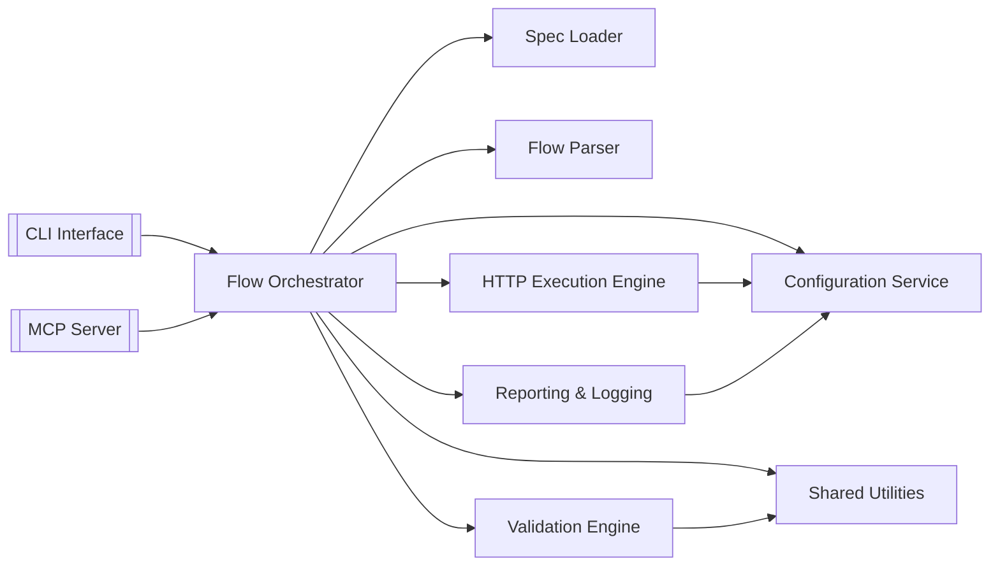

# 系統元件

### 主要模組
- **CLI Interface (`apps/cli`)** – 解析指令、呼叫流程協調器、處理退出碼。
- **MCP Server (`apps/mcp-server`)** – 實作 JSON-RPC 2.0，提供 `listSpecs`、`runFlow`、`getReport` 等方法。
- **Flow Orchestrator (`packages/core-flow`)** – 核心協調層，負責載入規格/流程、執行步驟、收集結果。
- **Spec Loader (`packages/spec-loader`)** – 解析與驗證 OpenAPI。
- **Flow Parser (`packages/flow-parser`)** – 解析 flow.yaml 並產生 `FlowDefinition`。
- **HTTP Execution Engine (`packages/http-runner`)** – 包裝 axios 處理請求、重試、timeout。
- **Validation Engine (`packages/validation`)** – AJV 驗證與自訂規則。
- **Reporting & Logging (`packages/reporting`)** – 產出報告、寫入 JSONL 日誌。
- **Configuration Service (`packages/config`)** – 整合 node-config / dotenv-flow。
- **Shared Utilities (`packages/shared`)** – 共用型別、錯誤類型、日期/UUID 工具。

### 元件關係圖


