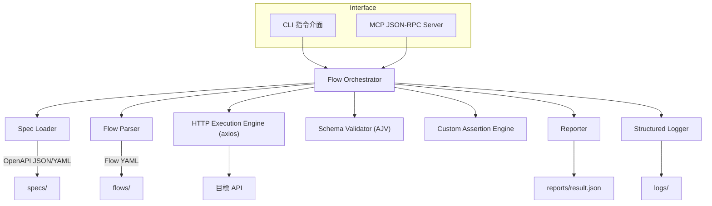

# 高階架構

### 技術摘要
SpecPilot 採模組化單體（Modular Monolith）+ 六角式分層，核心分成 CLI / MCP 介面層、流程協調器、規格與流程解析服務、HTTP 執行引擎、驗證與報告模組。各模組以 TypeScript 撰寫並透過依賴注入協作，確保 CLI、自動化流程與 MCP Agent 共用同一條驗證管線。技術堆疊以 Node.js 18+ 並鎖定 20.11.1 LTS 搭配 TypeScript 5.4.5，整合 axios、yaml、swagger-parser、ajv 等工具。設計滿足 PRD 所述「自動驗證 API 規格、輸出報告、供 AI 代理使用」，並兼顧後續擴充與運行成本。

### 概念性描述
1. **架構型態：** 模組化單體，藉六角式介面分層隔離外部輸入（CLI/MCP/檔案）與核心領域。與微服務相比，部署成本低、同步管理容易。
2. **版本庫策略：** 依 PRD 指示採 Monorepo，集中管理 CLI、MCP 與核心套件，利於 AI 與人類開發者協作。
3. **服務切割：** 單一 Node.js 應用提供 CLI 指令與 JSON-RPC 介面，內部再拆為規格載入器、流程協調器、HTTP 執行器、驗證器、報告器。
4. **資料/互動流程：** 使用者或 AI 透過 CLI / MCP 呼叫 → 協調器載入 OpenAPI 與 Flow → 依序執行 HTTP 呼叫 → 驗證狀態碼 / Schema / 自訂規則 → 寫入報告與結構化日誌。
5. **關鍵決策：**
   - 以檔案系統 (`specs/`, `flows/`, `reports/`) 作為主要儲存，符合 Epic 需求。
   - HTTP 引擎包裝 axios 支援 Token、重試與 Timeout。
   - 驗證層使用 AJV 搭配自訂 keywords 完成 custom.notNull/regex 等擴充。
   - 日誌採 JSON Lines（Pino），滿足 NFR6 的可追蹤性與安全性。

### 高階系統圖

### 架構與設計模式
- **模組化單體 + 六角式架構：** 相較傳統三層或微服務，兼顧短期效率與長期可拆分彈性。
- **依賴反轉 / 輕量 DI：** 使用容器（tsyringe 或自製 factory）統一注入 HTTP 客戶端、Logger、設定服務，提高測試性。
- **管線式流程處理：** 每個 Flow Step 透過 HTTP → Schema → Custom Rules → Reporter 的管線模式處理，便於插入額外驗證。
- **結構化日誌 + 事件代碼：** 使用 JSON Lines 格式與事件代碼，方便之後接入觀測或告警系統。

