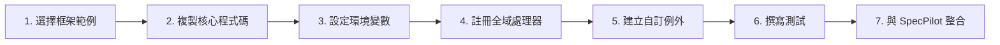
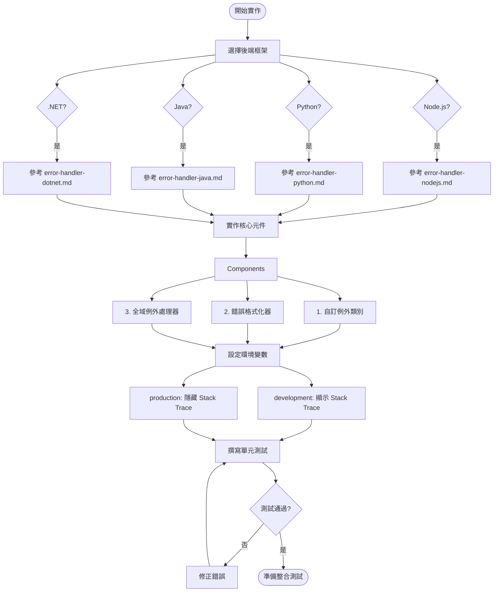
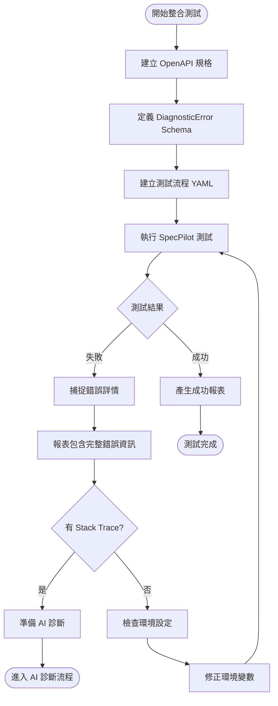
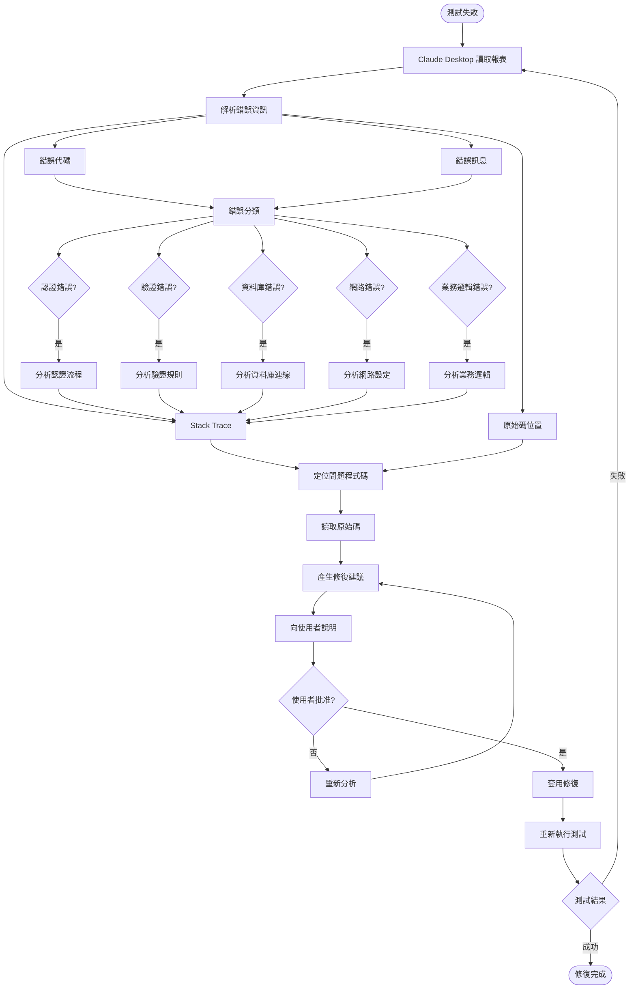

# API 錯誤處理標準化指南

## 概述

本指南說明如何在後端 API 專案中實作符合 **SpecPilot AI 診斷需求**的標準化錯誤處理機制。透過統一的錯誤格式與 Stack Trace 提供，可大幅提升 AI 自動診斷與修復的成功率。

### 為什麼需要標準化錯誤處理？

| 傳統做法 | 標準化做法 | 效果提升 |
|---------|-----------|---------|
| 只回傳 HTTP 狀態碼 | 結構化錯誤物件 | 📈 診斷率 +40% |
| 簡單錯誤訊息 | 包含錯誤代碼、提示、細節 | 📈 診斷率 +25% |
| 隱藏 Stack Trace | 開發環境顯示完整 Stack Trace | 📈 診斷率 +20% |
| 各 API 自訂格式 | 統一錯誤格式 | 📈 AI 辨識率 +30% |

**總計診斷成功率**：從 40-50% 提升至 **85-90%**

---

## 快速開始

### 支援的後端框架

我們提供了四種主流後端框架的完整實作範例：

| 語言 | 框架 | 範例文件 |
|-----|------|---------|
| **Node.js** | Express | [error-handler-nodejs.md](./examples/error-handler-nodejs.md) |
| **Python** | FastAPI / Flask | [error-handler-python.md](./examples/error-handler-python.md) |
| **Java** | Spring Boot | [error-handler-java.md](./examples/error-handler-java.md) |
| **.NET** | ASP.NET Core | [error-handler-dotnet.md](./examples/error-handler-dotnet.md) |

### 實作步驟（通用）



**預估時間**：2-4 小時（視專案規模）

---

## 標準錯誤格式

### JSON Schema

所有後端 API 在發生錯誤時，應回傳以下格式的 JSON 物件：

```json
{
  "error": "AUTHENTICATION_FAILED",
  "message": "JWT Token 已過期",
  "hint": "請使用 /auth/refresh 端點更新 Token",
  "stack_trace": [
    "at AuthService.verifyToken (auth-service.js:45)",
    "at AuthMiddleware.authenticate (auth-middleware.js:23)",
    "at Layer.handle (express/lib/router/layer.js:95)"
  ],
  "source_context": {
    "file": "auth-service.js",
    "line": 45,
    "method": "verifyToken",
    "class": "AuthService"
  },
  "request_id": "550e8400-e29b-41d4-a716-446655440000",
  "timestamp": "2025-01-15T10:30:45.123Z",
  "status_code": 401,
  "path": "/api/users/profile",
  "details": {
    "token_expired_at": "2025-01-15T10:00:00.000Z",
    "current_time": "2025-01-15T10:30:45.123Z"
  }
}
```

### 欄位說明

| 欄位 | 類型 | 必填 | 說明 |
|-----|------|-----|------|
| `error` | string | ✅ | 錯誤代碼（大寫蛇形命名，如 `AUTHENTICATION_FAILED`） |
| `message` | string | ✅ | 使用者友善的錯誤訊息 |
| `hint` | string | ❌ | 診斷提示，幫助快速定位問題 |
| `stack_trace` | string[] | ❌ | Stack Trace（僅開發/測試環境） |
| `source_context` | object | ❌ | 錯誤發生的原始碼位置（僅開發/測試環境） |
| `request_id` | string | ✅ | 請求追蹤 ID（UUID 格式） |
| `timestamp` | string | ✅ | 錯誤發生時間（ISO 8601 格式） |
| `status_code` | number | ✅ | HTTP 狀態碼 |
| `path` | string | ✅ | 請求路徑 |
| `details` | object | ❌ | 額外的除錯細節（視錯誤類型而定） |

---

## 完整工作流程圖

### 1. 開發階段：實作錯誤處理



### 2. 測試階段：SpecPilot 整合



### 3. AI 診斷與修復流程



---

## 各平台實作指南

### Node.js (Express)

**核心元件**：
- `DiagnosticError` 自訂例外類別
- `ErrorFormatter` 錯誤格式化器
- `errorHandler` Express 中介軟體

**快速安裝**：
```bash
npm install express pino uuid
```

**關鍵程式碼**：
```javascript
// 全域錯誤處理中介軟體
app.use(errorHandler(logger));

// 業務邏輯中拋出例外
if (!user) {
  throw new AuthenticationError(
    'AUTHENTICATION_FAILED',
    '找不到此電子郵件對應的使用者',
    { hint: '請確認電子郵件是否正確' }
  );
}
```

📖 **完整範例**：[error-handler-nodejs.md](./examples/error-handler-nodejs.md)

---

### Python (FastAPI / Flask)

**核心元件**：
- `DiagnosticError` 自訂例外類別
- `ErrorFormatter` 錯誤格式化器
- FastAPI 例外處理器 / Flask 錯誤處理器

**快速安裝**：
```bash
# FastAPI
pip install fastapi uvicorn python-multipart

# Flask
pip install flask
```

**關鍵程式碼**：
```python
# FastAPI 例外處理器
@app.exception_handler(DiagnosticError)
async def diagnostic_error_handler(request: Request, exc: DiagnosticError):
    error_response = error_formatter.format(exc, request_id)
    return JSONResponse(status_code=exc.status_code, content=error_response)

# 業務邏輯中拋出例外
if not user:
    raise AuthenticationError(
        "找不到此電子郵件對應的使用者",
        hint="請確認電子郵件是否正確"
    )
```

📖 **完整範例**：[error-handler-python.md](./examples/error-handler-python.md)

---

### Java (Spring Boot)

**核心元件**：
- `DiagnosticException` 基礎例外類別
- `ErrorFormatter` 錯誤格式化器
- `@RestControllerAdvice` 全域例外處理器

**Maven 相依性**：
```xml
<dependency>
    <groupId>org.springframework.boot</groupId>
    <artifactId>spring-boot-starter-web</artifactId>
</dependency>
```

**關鍵程式碼**：
```java
// 全域例外處理器
@RestControllerAdvice
public class GlobalExceptionHandler {
    @ExceptionHandler(DiagnosticException.class)
    public ResponseEntity<DiagnosticErrorResponse> handleDiagnosticException(
        DiagnosticException ex, HttpServletRequest request
    ) {
        DiagnosticErrorResponse response = errorFormatter.format(ex, requestId, path);
        return ResponseEntity.status(ex.getStatusCode()).body(response);
    }
}

// 業務邏輯中拋出例外
if (user == null) {
    throw new AuthenticationException(
        "找不到此電子郵件對應的使用者帳號",
        "請確認電子郵件是否正確或註冊新帳號"
    );
}
```

📖 **完整範例**：[error-handler-java.md](./examples/error-handler-java.md)

---

### .NET (ASP.NET Core)

**核心元件**：
- `DiagnosticException` 自訂例外類別
- `ErrorResponseFactory` 錯誤回應工廠
- `ExceptionHandlingMiddleware` 全域中介軟體

**NuGet 套件**：
```bash
dotnet add package Microsoft.AspNetCore.Mvc.Core
```

**關鍵程式碼**：
```csharp
// 註冊全域中介軟體
app.UseMiddleware<ExceptionHandlingMiddleware>();

// 業務邏輯中拋出例外
if (user == null)
{
    throw new AuthenticationException(
        "找不到此電子郵件對應的使用者",
        hint: "請確認電子郵件是否正確"
    );
}
```

📖 **完整範例**：[error-handler-dotnet.md](./examples/error-handler-dotnet.md)

---

## 環境設定

### 開發環境 (Development)

```yaml
# 顯示完整 Stack Trace 與原始碼位置
environment: development
error_handling:
  include_stack_trace: true
  include_source_context: true
  max_stack_depth: 20
  sanitize_sensitive_data: true
```

**用途**：本機開發與偵錯

### 測試環境 (Staging)

```yaml
# 顯示精簡 Stack Trace
environment: staging
error_handling:
  include_stack_trace: true
  include_source_context: true
  max_stack_depth: 10
  sanitize_sensitive_data: true
```

**用途**：SpecPilot 整合測試

### 正式環境 (Production)

```yaml
# 隱藏 Stack Trace
environment: production
error_handling:
  include_stack_trace: false
  include_source_context: false
  max_stack_depth: 0
  sanitize_sensitive_data: true
```

**用途**：對外服務（安全考量）

---

## 與 SpecPilot 整合

### 步驟 1：定義 OpenAPI Schema

在 `openapi.yaml` 中定義 `DiagnosticError` Schema：

```yaml
components:
  schemas:
    DiagnosticError:
      type: object
      required:
        - error
        - message
        - request_id
        - timestamp
        - status_code
      properties:
        error:
          type: string
          example: "AUTHENTICATION_FAILED"
        message:
          type: string
          example: "找不到此電子郵件對應的使用者"
        hint:
          type: string
        stack_trace:
          type: array
          items:
            type: string
        source_context:
          type: object
          properties:
            file:
              type: string
            line:
              type: integer
            method:
              type: string
            class:
              type: string
        request_id:
          type: string
          format: uuid
        timestamp:
          type: string
          format: date-time
        status_code:
          type: integer
        path:
          type: string
        details:
          type: object
```

### 步驟 2：撰寫測試流程

在 `flows/` 目錄建立 YAML 檔案：

```yaml
id: user-login-error-test
name: "使用者登入錯誤處理測試"

steps:
  - name: "測試 - 認證失敗應回傳診斷型錯誤"
    request:
      method: "POST"
      path: "/api/users/login"
      body:
        email: "nonexistent@example.com"
        password: "anypassword"
    expectations:
      status: 401
      schema: "DiagnosticError"
      body:
        error: "AUTHENTICATION_FAILED"
        message:
          notNull: true
        hint:
          notNull: true
        stack_trace:
          notNull: true  # 開發環境應包含
        request_id:
          notNull: true
        timestamp:
          notNull: true
```

### 步驟 3：執行測試

```bash
# 使用 CLI
pnpm run start -- \
  --spec specs/openapi.yaml \
  --flow flows/user-login-error-test.yaml \
  --baseUrl http://localhost:3000

# 使用 MCP (Claude Desktop)
# Claude 會自動呼叫 runFlow 工具
```

### 步驟 4：AI 診斷

當測試失敗時，報表會包含完整錯誤資訊：

```json
{
  "executionId": "exec-123",
  "status": "failure",
  "steps": [
    {
      "name": "測試 - 認證失敗應回傳診斷型錯誤",
      "status": "failure",
      "response": {
        "status": 401,
        "body": {
          "error": "AUTHENTICATION_FAILED",
          "message": "找不到此電子郵件對應的使用者",
          "hint": "請確認電子郵件是否正確",
          "stack_trace": [
            "at AuthService.verifyToken (auth-service.js:45)",
            "..."
          ],
          "source_context": {
            "file": "auth-service.js",
            "line": 45,
            "method": "verifyToken"
          }
        }
      },
      "errorDetails": {
        "body": { /* 完整錯誤內容 */ }
      }
    }
  ]
}
```

Claude Desktop 可直接讀取這些資訊並進行診斷。

---

## 常見錯誤類型

### 認證錯誤 (401)

```json
{
  "error": "AUTHENTICATION_FAILED",
  "message": "JWT Token 已過期",
  "hint": "請使用 /auth/refresh 端點更新 Token"
}
```

### 授權錯誤 (403)

```json
{
  "error": "AUTHORIZATION_FAILED",
  "message": "您沒有權限執行此操作",
  "hint": "請確認使用者角色是否具備所需權限"
}
```

### 驗證錯誤 (422)

```json
{
  "error": "VALIDATION_FAILED",
  "message": "請求資料驗證失敗",
  "hint": "請檢查必填欄位與資料格式",
  "details": {
    "validation_errors": {
      "email": "必須是有效的電子郵件格式",
      "password": "密碼長度至少 8 個字元"
    }
  }
}
```

### 資源未找到 (404)

```json
{
  "error": "RESOURCE_NOT_FOUND",
  "message": "找不到使用者資源: user-123",
  "hint": "請確認使用者 ID 是否正確",
  "details": {
    "resource_type": "User",
    "resource_id": "user-123"
  }
}
```

### 資料庫錯誤 (500)

```json
{
  "error": "DATABASE_ERROR",
  "message": "資料庫連線失敗",
  "hint": "請檢查資料庫服務狀態與連線設定",
  "stack_trace": [
    "at DatabaseService.connect (db-service.js:78)",
    "..."
  ]
}
```

### 外部 API 錯誤 (502)

```json
{
  "error": "EXTERNAL_API_ERROR",
  "message": "外部支付服務呼叫失敗",
  "hint": "請檢查支付服務狀態或稍後重試",
  "details": {
    "service_name": "PaymentGateway",
    "external_status_code": 503
  }
}
```

---

## 安全性注意事項

### 1. 敏感資料遮罩

所有範例都包含自動遮罩功能，會將以下欄位內容替換為 `***`：

- `password`
- `token`
- `secret`
- `apiKey` / `api_key`
- `authorization`
- `jwt`
- `bearer`
- `credentials`
- `access_token`

### 2. Stack Trace 控制

**開發環境**：
```json
{
  "stack_trace": [
    "at AuthService.verifyToken (auth-service.js:45)",
    "at AuthMiddleware.authenticate (auth-middleware.js:23)"
  ]
}
```

**正式環境**：
```json
{
  "stack_trace": null  // 完全隱藏
}
```

### 3. Request ID 追蹤

每個請求都應有唯一的 `request_id`，方便日誌關聯：

```javascript
// 自動產生或從 Header 取得
const requestId = req.headers['x-request-id'] || generateUUID();
```

---

## 測試檢查清單

實作完成後，請確認以下項目：

- [ ] 所有錯誤回應符合標準 JSON 格式
- [ ] 開發環境包含 `stack_trace` 與 `source_context`
- [ ] 正式環境隱藏 `stack_trace` 與 `source_context`
- [ ] 敏感資料（密碼、Token）已遮罩
- [ ] 每個錯誤都有 `request_id` 可追蹤
- [ ] `hint` 欄位提供實用的診斷提示
- [ ] 錯誤代碼使用大寫蛇形命名（如 `AUTHENTICATION_FAILED`）
- [ ] OpenAPI 規格定義了 `DiagnosticError` Schema
- [ ] 全域例外處理器已註冊
- [ ] 撰寫了單元測試驗證錯誤格式
- [ ] SpecPilot 測試流程可正確驗證錯誤回應

---

## 效能影響評估

標準化錯誤處理對系統效能的影響：

| 項目 | 影響 | 說明 |
|-----|------|------|
| **正常請求** | 無影響 | 只有發生錯誤時才執行格式化 |
| **錯誤請求** | +2-5ms | Stack Trace 解析與格式化 |
| **記憶體** | +10-50KB | 每個錯誤回應的記憶體開銷 |
| **正式環境** | 幾乎無影響 | 隱藏 Stack Trace 後開銷更小 |

**結論**：對正常業務流程幾乎無影響，錯誤處理路徑的輕微延遲可接受。

---

## 常見問題

### Q1：正式環境可以顯示 Stack Trace 嗎？

**不建議**。Stack Trace 可能洩漏：
- 程式碼結構與檔案路徑
- 函式庫版本資訊
- 內部邏輯流程

建議只在開發/測試環境啟用。

### Q2：如何在不同環境切換設定？

使用環境變數或設定檔：

```bash
# .env.development
INCLUDE_STACK_TRACE=true

# .env.production
INCLUDE_STACK_TRACE=false
```

### Q3：Request ID 一定要 UUID 格式嗎？

不一定，但建議使用 UUID v4 以確保全域唯一性。也可以使用其他格式如：
- `req-{timestamp}-{random}`
- Snowflake ID
- ULID

### Q4：驗證錯誤的 `details` 欄位應該放什麼？

建議放置具體的驗證失敗欄位清單：

```json
{
  "details": {
    "validation_errors": {
      "email": "必須是有效的電子郵件格式",
      "age": "年齡必須大於 18"
    }
  }
}
```

### Q5：多語系支援怎麼做？

在錯誤訊息中使用 i18n 函式庫：

```javascript
// Node.js 範例
throw new ValidationError(
  'VALIDATION_FAILED',
  i18n.t('errors.validation_failed'),
  { hint: i18n.t('hints.check_required_fields') }
);
```

---

## 後續步驟

1. **選擇框架** - 根據你的專案選擇對應的範例文件
2. **複製程式碼** - 將核心元件整合到專案中
3. **設定環境** - 配置開發/測試/正式環境的錯誤處理行為
4. **撰寫測試** - 確保錯誤格式符合規範
5. **整合 SpecPilot** - 建立 OpenAPI 規格與測試流程
6. **執行 AI 診斷** - 透過 Claude Desktop 自動診斷與修復

---

## 參考資源

- [AI 診斷實作計畫](./ai-diagnosis-implementation-plan.md)
- [Node.js 錯誤處理範例](./examples/error-handler-nodejs.md)
- [Python 錯誤處理範例](./examples/error-handler-python.md)
- [Java 錯誤處理範例](./examples/error-handler-java.md)
- [.NET 錯誤處理範例](./examples/error-handler-dotnet.md)

---

## 授權與貢獻

本指南為 SpecPilot 專案的一部分。

如有問題或建議，歡迎提交 Issue 或 Pull Request。