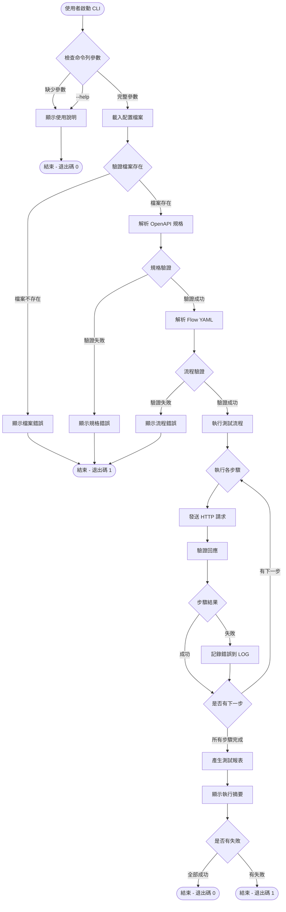
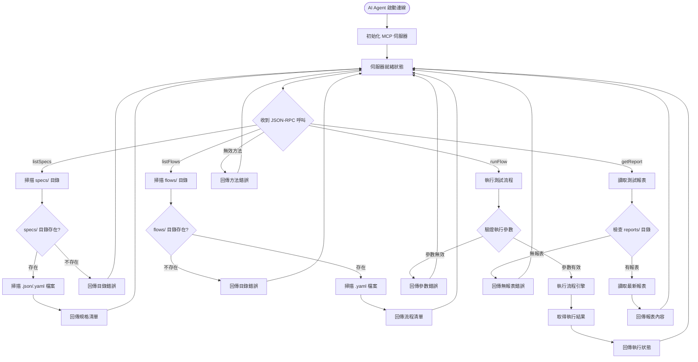
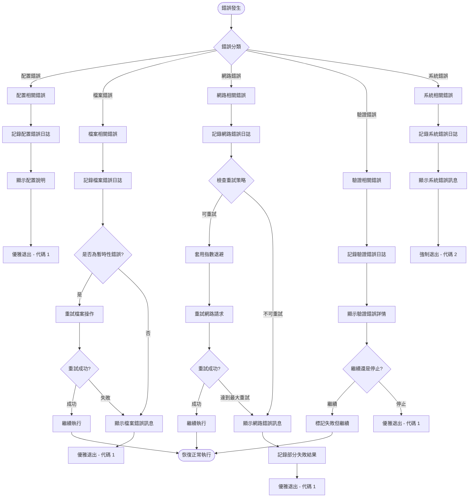

# SpecPilot Product Requirements Document (PRD)

## Goals and Background Context

### Goals
- 建立一個能與 AI Agent 協作的自動化 API 測試與驗證系統，透過 MCP 介面提供遠端可觸發的測試能力。
- 支援以 OpenAPI/Swagger 規格與 YAML 測試流程為輸入，確保多種 API 專案皆能快速導入。
- 提供結構化 JSON 測試報表，便於 CI/CD 與 AI 工具快速定位錯誤並進行自動修正。

### Background Context
本專案為新建案，團隊計畫使用 Node.js 與 TypeScript 打造聚焦於 API 測試的工具。其核心需求是透過流程檔快速定義測試步驟，加上 AI 驅動的動態驗證能力，協助開發與維運在 CI/CD 流程中自動驗證 API 行為。本文件依據 `docs/SpecPilot-Req.md` 匯整與延伸需求，確保 PRD 內容與原始構想保持一致。

### Target User Personas

#### 👨‍💻 **Primary Persona 1: DevOps 工程師 - Alex**
**基本資訊**: 28-35歲，3-8年 DevOps/SRE 經驗，熟悉 CI/CD、Docker、Kubernetes、Shell scripting

**核心目標**:
- 在 CI/CD 流程中自動驗證 API 的正確性，減少生產環境問題
- 快速驗證 API 變更不會破壞既有功能
- 提升部署信心，減少半夜被叫起來修 bug

**主要痛點**:
- 🔴 **手動 API 測試耗時**: 使用 Postman/Insomnia 手動測試每個 API 端點
- 🔴 **CI 流程不完整**: 缺乏標準化的 API 驗證步驟
- 🔴 **錯誤發現太晚**: API 問題經常在生產環境才被發現
- 🔴 **多環境配置複雜**: 需要為 dev/staging/prod 維護不同的測試配置

**SpecPilot 價值主張**:
- ✅ CLI 整合: 輕鬆整合至現有 CI/CD 腳本
- ✅ 環境參數覆寫: 一套流程適用多個環境
- ✅ 結構化報表: 便於 CI 系統解析和告警
- ✅ 快速反饋: 1分鐘內完成 API 驗證

#### 🧪 **Primary Persona 2: QA 測試工程師 - Sarah**
**基本資訊**: 25-32歲，2-6年軟體測試經驗，熟悉 API 測試、自動化測試框架、YAML/JSON 格式

**核心目標**:
- 確保 API 功能符合需求規格，提供完整的測試覆蓋
- 建立可重複使用的測試流程，減少重複性工作
- 及早發現 API 邏輯錯誤和資料格式問題

**主要痛點**:
- 🔴 **測試案例難以維護**: API 變更時需要更新多個測試腳本
- 🔴 **測試資料管理複雜**: 不同測試場景需要不同的測試資料準備
- 🔴 **驗證規則撰寫困難**: 複雜的回應驗證需要寫程式碼
- 🔴 **測試結果追蹤困難**: 難以快速定位失敗的原因和位置

**SpecPilot 價值主張**:
- ✅ YAML 流程定義: 直觀的測試腳本撰寫方式
- ✅ Schema 自動驗證: 基於 OpenAPI 規格自動驗證回應格式
- ✅ 自訂驗證規則: 支援業務邏輯驗證 (notNull, regex, contains)
- ✅ 詳細錯誤報告: 清楚指出驗證失敗的具體位置

#### 🤖 **Primary Persona 3: AI Agent 整合者 - Jordan**
**基本資訊**: 26-40歲，2-10年軟體開發經驗，1-3年 AI 整合經驗，熟悉 AI/LLM 整合、API 開發、自動化工具開發

**核心目標**:
- 讓 AI Agent 能自動驗證 API 功能，支援 AI 驅動的開發流程
- 無縫整合到 AI 工作流，支援動態測試生成
- 減少人工介入，讓 AI 自主進行 API 驗證

**主要痛點**:
- 🔴 **API 測試工具不支援程式化呼叫**: 現有工具主要設計給人類使用
- 🔴 **動態內容處理困難**: AI 生成的測試內容難以整合到現有工具
- 🔴 **錯誤格式不統一**: 不同工具的錯誤格式讓 AI 難以理解
- 🔴 **即時反饋需求**: AI 需要快速得到測試結果以進行後續決策

**SpecPilot 價值主張**:
- ✅ MCP JSON-RPC 介面: 標準化的 AI Agent 整合方式
- ✅ 即時內容支援: 支援 AI 動態生成的測試內容
- ✅ 結構化錯誤回應: JSON-RPC 格式便於 AI 理解和處理
- ✅ 無檔案依賴: 支援純記憶體內的測試執行

### Market Positioning & Competitive Analysis

#### **vs 現有解決方案對比**
| 解決方案 | Postman/Insomnia | Newman | RestAssured | SpecPilot |
|----------|------------------|--------|-------------|-----------|
| **CLI 整合** | 🟡 有限 | ✅ 優秀 | ✅ 優秀 | ✅ 優秀 |
| **AI 整合** | ❌ 困難 | ❌ 困難 | ❌ 困難 | ✅ 原生支援 |
| **OpenAPI 整合** | 🟡 部分 | 🟡 部分 | ✅ 優秀 | ✅ 優秀 |
| **動態內容** | ❌ 不支援 | ❌ 不支援 | 🟡 有限 | ✅ 原生支援 |
| **學習曲線** | 🟡 中等 | 🟡 中等 | 🔴 陡峭 | 🟢 平緩 |

#### **SpecPilot 差異化優勢**
1. **AI-First 設計**: 原生支援 MCP 協議，專為 AI Agent 整合設計
2. **雙模式操作**: CLI + MCP 滿足人工和自動化兩種使用場景
3. **動態內容支援**: 支援 AI 即時生成的測試內容，無檔案系統依賴
4. **OpenAPI 驅動**: 基於 OpenAPI 規格的自動化驗證，減少手動配置

### Change Log
| Date       | Version | Description                                 | Author    |
|------------|---------|---------------------------------------------|-----------|
| 2025-02-15 | v0.1    | 初版草稿，依據 `docs/SpecPilot-Req.md` 匯整 | John (PM) |

## Requirements

### Functional Requirements
1. FR1：系統必須支援載入 OpenAPI 規格檔，含 JSON (`swagger.json`) 與 YAML (`openapi.yaml`) 兩種格式，並能自動判斷與解析。
2. FR2：系統必須支援由 YAML 格式撰寫的測試流程 (`flow.yaml`)，包含步驟名稱、HTTP 呼叫與驗證設定。
3. FR3：每個測試步驟需依序執行對應的 HTTP 呼叫，並驗證回應的 HTTP 狀態碼。
4. FR4：系統需可根據 OpenAPI `components.schemas` 驗證回應結構是否符合指定 Schema。
5. FR5：系統需支援基本自訂驗證規則（如 `custom.notNull`、`custom.regex`、`custom.contains`），提供必填欄位檢查、字串格式比對與陣列長度等常見驗證功能。
6. FR6：測試結果需輸出統一的 JSON 報表 (`reports/result.json`)，包含每個步驟的狀態、錯誤訊息與時間戳。
7. FR7：系統需提供 MCP JSON-RPC 介面，至少支援 `listSpecs`、`listFlows`、`runFlow`、`getReport` 方法。
8. FR8：`runFlow` 需支援 AI 即時傳入的 `specContent` 與 `flowContent`，無須事先寫入檔案即可執行。
9. FR9：`runFlow` 執行過程中若出現錯誤，系統需回傳符合 JSON-RPC 規範的錯誤物件，避免 MCP 崩潰。
10. FR10：系統需支援登入與 Token 管理，可透過流程中的登入步驟取得 JWT Token，或在專案設定／文件中指定 Token；系統需自動依標準格式（如 `Authorization: Bearer <JWT>`）加入後續請求 Header。
11. FR11：系統需支援設定 API 測試環境的 `baseUrl` 與 `port`，可透過 `flow.yaml`、共用設定檔或 `runFlow` 參數傳入（含 AI 即時傳入模式），執行時自動組合完整請求 URL；未提供埠號時需採用預設值（HTTP: 80、HTTPS: 443）。
12. FR12：系統需在執行每個測試步驟時記錄結構化 LOG（步驟名稱、請求細節、回應摘要、錯誤訊息、執行時間），使用 pino 套件輸出 JSON Lines 格式，強制包含 executionId、component 等識別欄位，並支援輸出至檔案與程式介面查閱。

### Non-Functional Requirements
1. NFR1：系統需在 Node.js 20.11.1 LTS 環境執行，且不得依賴 .NET Runtime。
2. NFR2：單一測試流程 (`flow.yaml`) 的執行時間應在 1 分鐘以內，並以標準開發環境（4 核心 CPU、8 GB RAM、本地或等效 Docker）為測試基準。
3. NFR3：系統需能處理大型 OpenAPI 規格（如 ≥500 endpoints），若因資源限制導致錯誤或效能瓶頸，需顯示明確警示或錯誤訊息，避免靜默失敗。
4. NFR4：支援基本跨步驟變數傳遞功能，確保資料在流程中正確傳遞。
5. NFR5：自訂驗證規則採用內建實作方式，確保驗證功能的穩定性和可靠性。
6. NFR6：所有錯誤情境應被完整記錄在報表與 LOG 中，同時維持 MCP 服務穩定運作。

## User Experience Requirements

### Overall UX Vision
本專案專注於提供直觀、可靠的 CLI 與 MCP 介面體驗，確保 DevOps 工程師、QA 測試員和 AI Agent 能夠高效使用系統進行 API 測試驗證。

### Key Interaction Paradigms
- **CLI 模式**：命令列指令驅動，提供即時反饋和清楚的錯誤訊息
- **MCP 模式**：JSON-RPC 呼叫驅動，確保 AI Agent 能穩定整合
- **錯誤處理**：統一的錯誤分類與恢復策略

### User Journey Maps

#### 1. CLI 使用者流程

#### 2. MCP 使用者流程

### Error Handling & Recovery Flows

#### 錯誤分類與處理策略

#### 錯誤碼與處理對照表
| 錯誤類型 | CLI 處理 | MCP 錯誤碼 | 恢復策略 |
|---------|---------|-----------|---------|
| **配置檔案缺失** | 顯示範例配置 | 1501 | 不可恢復 |
| **OpenAPI 規格無效** | 顯示驗證錯誤詳情 | 1502 | 不可恢復 |
| **Flow YAML 格式錯誤** | 顯示語法錯誤位置 | 1503 | 不可恢復 |
| **網路連線失敗** | 重試 3 次，指數退避 | 1504 | 可恢復 |
| **API 回應超時** | 重試 3 次，記錄部分結果 | 1505 | 可恢復 |
| **驗證失敗** | 繼續執行但標記失敗 | 1506 | 可恢復 |
| **Token 無效** | 提示重新登入 | 1507 | 可恢復 |
| **檔案權限錯誤** | 顯示權限要求 | 1508 | 不可恢復 |
| **記憶體不足** | 優雅退出並清理 | 1600 | 不可恢復 |

### Accessibility & Platform Support
- **Platform Compatibility**: Cross-Platform（Node.js + MCP 於 Windows、macOS、Linux 執行）
- **Terminal Support**: 相容各主流終端機，包含輸出格式與編碼
- **Logging Accessibility**: 結構化日誌便於自動化工具解析
- **Error Message Clarity**: 錯誤訊息提供中英文版本，包含解決建議

## Technical Assumptions

## 開發環境與安裝指南
1. 安裝 Node.js 20.11.1 LTS 與 pnpm 9.1：建議使用 `corepack` 啟用並鎖定版本，確保所有成員一致。
2. 取得程式碼：`git clone <repository-url>` 並切換至專案根目錄 `specpilot/`。
3. 安裝依賴：於專案根目錄執行 `pnpm install`，一次安裝 Monorepo 中 apps 與 packages 的套件。
4. 建立環境變數檔：`cp .env.example .env.local`，依環境填寫 `SPEC_PILOT_BASE_URL`、`SPEC_PILOT_PORT`、`SPEC_PILOT_TOKEN` 等變數；敏感資訊禁止提交版本控制。
5. 啟動 CLI/測試流程：
   - `pnpm run dev`：啟動開發模式並載入 CLI 指令（預期用於本地除錯）。
   - `pnpm run start`：以 Node.js 執行編譯後的 CLI。
   - `pnpm run start:mcp`：啟動 MCP JSON-RPC 伺服器。
   - `pnpm run lint`、`pnpm run test`：執行程式碼品質與測試流程。
6. 常用 CLI 範例：`pnpm run start -- --spec specs/openapi.yaml --flow flows/user_crud.yaml --baseUrl http://localhost:3000`；可透過參數覆寫 baseUrl/port/token。

## Secrets 與 Token 管理流程
- **區分環境檔案**：本地開發使用 `.env.local`，CI 使用 `.env.ci`，所有檔案均應列入 `.gitignore`。
- **設定載入流程**：Config Service 負責讀取環境變數並提供統一介面，CLI 與 MCP 皆透過該服務取得 Token/baseUrl/port。
- **敏感資訊來源**：
  - 本地：開發者可在 `.env.local` 中設定 `SPEC_PILOT_TOKEN` 或登入用的使用者密碼；必要時可補充 `specpilot secrets set` 等腳本輔助輸入。
  - Staging/Production：建議透過雲端 Secrets Manager（AWS Secrets Manager、GCP Secret Manager 等）動態注入環境變數，禁止寫入映像檔或程式碼庫。
- **Token 取得流程**：Flow 可包含登入步驟，將取得的 Token 儲存在 Run Context；若專案提供長期 Token，需透過設定檔宣告並在流程執行前注入。
- **輪替與失效機制**：Token 必須設定到期日並於輪替時更新 Secrets Manager；系統在檢測到 HTTP 401/403 時需記錄告警並提示重新登入或更新 Token。
- **稽核與遮罩**：所有日誌／報表均以 `***` 遮蔽 Token 與密碼欄位，並保留輪替紀錄以便追蹤。

## 目標 API Fallback 與模擬策略
- **主要測試環境**：預設連線至 `SPEC_PILOT_BASE_URL` 所指向的測試 API；CI 環境需提供可重複執行的 sandbox 或 staging。
- **模擬服務**：當目標 API 不可達或需隔離外部依賴時，CLI 與 MCP 可切換至 `flows/mock/` 內的流程，使用本地 Mock Server（建議以 `pnpm run mock` 啟動 nock/msw 伺服器）提供預錄回應。
- **Fallback 規則**：Flow 定義可為每個步驟設定 `fallback` 區段，指定替代 URL 或 Mock handler；當 HTTP 連線連續失敗並達到重試上限時，自動轉向 fallback。
- **資料一致性**：Mock 回應需同步更新至 `packages/testing/fixtures`，並在 PR 中註記來源與版本，避免與正式 API schema 偏離。
- **監控與警示**：啟用 fallback 時需於報表與 LOG 標示 `FALLBACK_USED` 事件，提醒維運人員調查實際 API 狀態。
- **恢復流程**：目標 API 恢復可用後，流程會在下一次執行前檢查健康狀態（可選擇 `healthcheck` 步驟）；確認成功即改回正式端點。

- Repository Structure：採 Monorepo 管理 CLI 執行器、MCP 伺服器與測試範例，便於共用型別、設定與腳本。
- Service Architecture：Node.js 單體應用，內部模組化拆分解析、執行、驗證、報表與 MCP 介面；短期不考慮微服務或無伺服器架構。
- Testing Requirements：採 Unit + Integration + End-to-End 策略；使用 Jest/Vitest 類測試框架並於 CI 自動執行。
- Additional Technical Assumptions and Requests：
  - 全面使用 TypeScript，搭配 `pnpm` 或 `npm` 管理依賴與鎖定檔。
  - HTTP 呼叫使用 `axios`，YAML 解析使用 `yaml`，Schema 驗證使用 `ajv`，OpenAPI 驗證使用 `swagger-parser`，CLI 框架使用 `commander`。
  - 透過輕量依賴注入（tsyringe 或等效方案）注入 Config、Logger、HTTP 客戶端，確保 CLI 與 MCP 共享模組。
  - 集中化設定檔或環境變數處理 baseUrl、port、token 等資訊；MCP `runFlow` 與 CLI 參數可覆寫。
  - 日誌採用 pino 套件，輸出 JSON Lines 格式，強制包含 executionId、component、timestamp 等必要欄位。
  - MCP 伺服器提供基本啟動腳本與簡易文件，說明核心 JSON-RPC 方法。
  - 所選套件均為主流且持續維護中，焦點於核心功能實現。

## Epic List
1. Epic 1：基礎架構與規格解析 — 建立即時可執行的專案骨架，完成 OpenAPI 與 Flow 檔載入與設定管理。
2. Epic 2：測試執行引擎與報表 — 實作 YAML 流程執行、驗證、Token 處理、結構化 LOG 與 JSON 報表。
3. Epic 3：MCP 介面與遠端整合 — 建置 JSON-RPC MCP 服務，支援即時內容傳入、環境參數覆寫與報表查詢。

## Epic Details

### Epic 1：基礎架構與規格解析
目標：建立可運行的 Node.js/TypeScript 專案骨架，完成 OpenAPI 與 Flow YAML 的載入、解析與設定管理。

- Story 1.1 初始化專案骨架與設定管理  
  As a 系統維運者, I want 初始化 TypeScript 專案骨架與環境設定, so that 團隊能在一致結構下開發與執行測試。  
  Acceptance Criteria  
  1: 建立 TypeScript + Node.js 專案結構，含編譯設定、lint 與 npm script（`start`, `start:mcp`, `test`）。  
  2: 提供集中化設定檔或環境變數處理 baseUrl、port、token。  
  3: 引入並配置結構化 Logger（JSON Lines），可輸出檔案與主控台。  
  4: README 說明初始化流程、環境變數與主要 script。

- Story 1.2 實作 OpenAPI 規格載入與驗證  
  As a 開發者, I want 將 JSON/YAML OpenAPI 規格載入並轉為標準 JSON, so that 後續流程可共用一致格式。  
  Acceptance Criteria  
  1: 支援本地檔案 `swagger.json`、`openapi.yaml` 與 AI 傳入的 `specContent`。  
  2: `.json` 以 JSON.parse，`.yaml/.yml` 以 `yaml` 套件解析；錯誤需給出明確訊息。  
  3: 使用 `swagger-parser` 驗證規格完整性，若有錯誤需攔截並回報。  
  4: 解析成功與失敗都需記錄 LOG。

- Story 1.3 實作 Flow YAML 解析與基本驗證  
  As a 測試工程師, I want 解析 `flow.yaml` 並驗證基本欄位, so that 測試腳本可轉為程式可用結構。  
  Acceptance Criteria  
  1: 支援載入本地檔案與 AI 傳入的 `flowContent`。  
  2: 解析後包含步驟名稱、HTTP 方法、路徑、期望驗證設定。  
  3: 缺少必要欄位時丟出明確錯誤並記錄 LOG。  
  4: 解析結果具 TypeScript 型別定義。

- Story 1.4 基礎 CLI 指令與設定覆寫  
  As a DevOps 工程師, I want 透過 CLI 指定規格/流程與環境設定, so that 可在不同環境快速執行測試。  
  Acceptance Criteria  
  1: CLI 支援 `--spec`, `--flow`, `--baseUrl`, `--port`, `--token`。  
  2: CLI 能呼叫 Story 1.2、1.3 的功能並回報結果。  
  3: 預設值來自集中設定，CLI 參數可覆寫。  
  4: CLI 執行紀錄於 LOG，包含解析摘要。

### Epic 2：測試執行引擎與報表
目標：完成 YAML 流程執行、HTTP 呼叫、Schema/自訂驗證、Token 處理與結構化 LOG，並輸出統一 JSON 報表。

- Story 2.1 建立 HTTP 執行器與 Token 注入  
  As a 測試工程師, I want 執行 YAML 步驟定義的 HTTP 呼叫, so that 能模擬 API 使用情境。  
  Acceptance Criteria  
  1: 使用 `axios` 送出 GET/POST/PUT/PATCH/DELETE 請求。  
  2: 自動拼接 baseUrl 與 path，並支援變數替換。  
  3: 支援在流程中儲存與注入 JWT（登入或設定檔來源），於 `Authorization: Bearer <JWT>` header 中使用。  
  4: 提供預設逾時或重試設定，可透過設定檔覆寫。

- Story 2.2 實作回應驗證與自訂規則  
  As a QA, I want 驗證回應的狀態碼、Schema 與自訂條件, so that 測試能準確捕捉異常。  
  Acceptance Criteria  
  1: 驗證 `expect.status`，不符時回報錯誤。  
  2: 若設置 `expect.schema`，使用 `ajv` 對應 OpenAPI `components.schemas` 驗證。  
  3: 支援 `custom.notNull`, `custom.regex`, `custom.contains` 等規則，並提供擴充介面。  
  4: 驗證結果需寫入 LOG，含成功與失敗細節。

- Story 2.3 支援登入步驟與 Token 管理  
  As a 測試工程師, I want 在流程中執行登入並重用 Token, so that 可驗證需身份認證的 API。  
  Acceptance Criteria  
  1: 支援在 YAML 步驟標記登入類型（如 `auth: login`）並指定取得 Token 的欄位路徑。  
  2: 支援在設定或 `flow.yaml` 指定靜態 Token，自動加入 Header。  
  3: Token 儲存需區分不同服務/命名空間，避免互相覆寫。  
  4: Token 缺失或失效時在 LOG 與報表中明示。

- Story 2.4 結構化 LOG 與報表輸出  
  As a 系統維運者, I want 紀錄測試過程並輸出報表, so that 能快速追蹤錯誤來源。  
  Acceptance Criteria  
  1: 每步驟在 LOG 紀錄請求摘要（方法、URL、Header、Body hash）與回應摘要（狀態碼、驗證結果、錯誤）。  
  2: LOG 支援時間戳與檔案輪替或區分，以免單檔過大。  
  3: 產生 `reports/result.json`，格式符合需求文件範例。  
  4: CLI 結束時在主控台輸出報表位置與失敗計數。

- Story 2.5 CLI 端到端測試涵蓋核心流程  
  As a 開發者, I want 自動化驗證 CLI 完整流程, so that 新增功能不會破壞既有行為。  
  Acceptance Criteria  
  1: 建立整合測試，模擬載入規格、解析流程、執行、驗證、輸出報表。  
  2: 測試涵蓋成功與失敗案例，包含錯誤時的 JSON-RPC 格式。  
  3: 測試納入 CI，自動檢查 NFR2 規定時間。  
  4: 測試資料放在 `specs/`、`flows/`、`reports/` 範例目錄。

### Epic 3：MCP 介面與遠端整合
目標：建置 JSON-RPC MCP 服務，支援列出資源、執行流程、查詢報表，並可覆寫環境設定。

- Story 3.1 建立 MCP 伺服器骨架  
  As a AI Agent 整合者, I want 啟動 MCP JSON-RPC 伺服器, so that AI 能透過 STDIN/STDOUT 呼叫測試服務。  
  Acceptance Criteria  
  1: `npm run start:mcp` 可啟動服務。  
  2: 服務遵循 JSON-RPC 2.0，可解析請求與回應。  
  3: 啟動時輸出健康狀態 LOG。  
  4: 異常需被捕捉並安全終止，不致崩潰。

- Story 3.2 實作 `listSpecs` 與 `listFlows`  
  As a AI Agent, I want 查詢可用的規格與流程清單, so that 能快速選擇測試資源。  
  Acceptance Criteria  
  1: `listSpecs` 回傳 `specs/` 目錄下 `.json`/`.yaml` 檔案清單。  
  2: `listFlows` 預設回傳所有 `.yaml`，並支援以參數指定目錄、檔名前綴或完整檔名進行篩選。  
  3: 回應格式為 JSON 陣列，若無符合項目需回傳清楚錯誤訊息。  
  4: 操作過程需記錄在 MCP LOG 中。

- Story 3.3 實作 `runFlow` 支援檔案與即時內容  
  As a AI Agent, I want 遠端觸發測試流程, so that 可以自動驗證 API。  
  Acceptance Criteria  
  1: `runFlow` 支援 `spec` + `flow`（檔案模式）與 `specContent` + `flowContent`（字串模式）。  
  2: 可傳入 `baseUrl`、`port`、`token` 等覆寫設定。  
  3: 執行流程重用 Epic 2 的引擎，回傳執行狀態與報表摘要。  
  4: 錯誤需以 JSON-RPC `error` 格式回傳並記錄 LOG。

- Story 3.4 實作 `getReport` 基本功能  
  As a AI Agent, I want 取得最新測試報表, so that 能快速檢視結果。  
  Acceptance Criteria  
  1: `getReport` 預設回傳最近一次 `runFlow` 產生的 `reports/result.json`。  
  2: 若無任何報表，回傳明確錯誤。  
  3: 提供基本檔案讀取功能。

- Story 3.5 MCP 介面文件與範例  
  As a 使用者, I want 了解 MCP 介面如何呼叫, so that 能整合到自動化流程。  
  Acceptance Criteria  
  1: 文件說明 MCP 啟動方式、支援方法與參數、回應範例。  
  2: 提供 JSON-RPC 範例請求檔或腳本。  
  3: 說明錯誤格式與常見錯誤碼。  
  4: README 更新 MCP 章節。

