# User Experience Requirements

### Overall UX Vision
本專案專注於提供直觀、可靠的 CLI 與 MCP 介面體驗，確保 DevOps 工程師、QA 測試員和 AI Agent 能夠高效使用系統進行 API 測試驗證。

### Key Interaction Paradigms
- **CLI 模式**：命令列指令驅動，提供即時反饋和清楚的錯誤訊息
- **MCP 模式**：JSON-RPC 呼叫驅動，確保 AI Agent 能穩定整合
- **錯誤處理**：統一的錯誤分類與恢復策略

### User Journey Maps

#### 1. CLI 使用者流程

#### 2. MCP 使用者流程

```mermaid
flowchart TD
    Start([AI Agent 啟動連線]) --> Initialize[初始化 MCP 伺服器]
    Initialize --> Ready[伺服器就緒狀態]
    
    Ready --> MethodCall{收到 JSON-RPC 呼叫}
    
    MethodCall -->|listSpecs| ListSpecs[掃描 specs/ 目錄]
    MethodCall -->|listFlows| ListFlows[掃描 flows/ 目錄]  
    MethodCall -->|runFlow| RunFlow[執行測試流程]
    MethodCall -->|getReport| GetReport[讀取測試報表]
    MethodCall -->|無效方法| InvalidMethod[回傳方法錯誤]
    
    ListSpecs --> ValidateSpecsDir{specs/ 目錄存在?}
    ValidateSpecsDir -->|存在| ScanSpecs[掃描 .json/.yaml 檔案]
    ValidateSpecsDir -->|不存在| SpecsDirError[回傳目錄錯誤]
    ScanSpecs --> ReturnSpecsList[回傳規格清單]
    
    ListFlows --> ValidateFlowsDir{flows/ 目錄存在?}
    ValidateFlowsDir -->|存在| ScanFlows[掃描 .yaml 檔案]
    ValidateFlowsDir -->|不存在| FlowsDirError[回傳目錄錯誤]
    ScanFlows --> ReturnFlowsList[回傳流程清單]
    
    RunFlow --> ValidateRunParams{驗證執行參數}
    ValidateRunParams -->|參數有效| ExecuteFlow[執行流程引擎]
    ValidateRunParams -->|參數無效| ParamError[回傳參數錯誤]
    ExecuteFlow --> FlowResult[取得執行結果]
    FlowResult --> ReturnFlowResult[回傳執行狀態]
    
    GetReport --> CheckReports{檢查 reports/ 目錄}
    CheckReports -->|有報表| ReadLatest[讀取最新報表]
    CheckReports -->|無報表| NoReportsError[回傳無報表錯誤]
    ReadLatest --> ReturnReport[回傳報表內容]
    
    ReturnSpecsList --> Ready
    ReturnFlowsList --> Ready
    ReturnFlowResult --> Ready
    ReturnReport --> Ready
    InvalidMethod --> Ready
    SpecsDirError --> Ready
    FlowsDirError --> Ready
    ParamError --> Ready
    NoReportsError --> Ready
```

### Error Handling & Recovery Flows

#### 錯誤分類與處理策略

#### 錯誤碼與處理對照表
| 錯誤類型 | CLI 處理 | MCP 錯誤碼 | 恢復策略 |
|---------|---------|-----------|---------|
| **配置檔案缺失** | 顯示範例配置 | 1501 | 不可恢復 |
| **OpenAPI 規格無效** | 顯示驗證錯誤詳情 | 1502 | 不可恢復 |
| **Flow YAML 格式錯誤** | 顯示語法錯誤位置 | 1503 | 不可恢復 |
| **網路連線失敗** | 重試 3 次，指數退避 | 1504 | 可恢復 |
| **API 回應超時** | 重試 3 次，記錄部分結果 | 1505 | 可恢復 |
| **驗證失敗** | 繼續執行但標記失敗 | 1506 | 可恢復 |
| **Token 無效** | 提示重新登入 | 1507 | 可恢復 |
| **檔案權限錯誤** | 顯示權限要求 | 1508 | 不可恢復 |
| **記憶體不足** | 優雅退出並清理 | 1600 | 不可恢復 |

### Accessibility & Platform Support
- **Platform Compatibility**: Cross-Platform（Node.js + MCP 於 Windows、macOS、Linux 執行）
- **Terminal Support**: 相容各主流終端機，包含輸出格式與編碼
- **Logging Accessibility**: 結構化日誌便於自動化工具解析
- **Error Message Clarity**: 錯誤訊息提供中英文版本，包含解決建議

